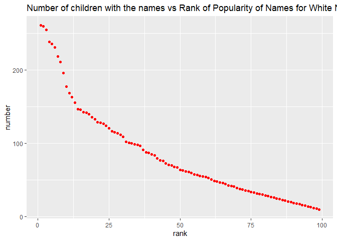

p8105\_hw2\_hz2770
================
Hao Zheng
2021/10/9

``` r
library(tidyverse)
```

    ## -- Attaching packages --------------------------------------- tidyverse 1.3.1 --

    ## v ggplot2 3.3.5     v purrr   0.3.4
    ## v tibble  3.1.4     v dplyr   1.0.7
    ## v tidyr   1.1.3     v stringr 1.4.0
    ## v readr   2.0.1     v forcats 0.5.1

    ## -- Conflicts ------------------------------------------ tidyverse_conflicts() --
    ## x dplyr::filter() masks stats::filter()
    ## x dplyr::lag()    masks stats::lag()

``` r
library(readxl)

# get the path of the dataset.
getwd()
```

    ## [1] "C:/Users/hao/OneDrive/Documents/R file/P8105_R code/p8105_hw2_hz2770"

## Problem 1

``` r
# Read and clean the Mr.Trash Wheel sheet
mr_trash_wheel_data = 
  read_excel("./data/Trash-Wheel-Collection-Totals-7-2020-2.xlsx",
             sheet = "Mr. Trash Wheel",
             range = cell_cols("A2:N534")) %>% 
  janitor::clean_names() %>%
  drop_na(dumpster) %>% 
  mutate(sports_balls = round(sports_balls, digits = 0))
```

    ## New names:
    ## * `` -> ...15
    ## * `` -> ...16
    ## * `` -> ...17

    ## Warning in FUN(X[[i]], ...): strings not representable in native encoding will
    ## be translated to UTF-8

    ## Warning in FUN(X[[i]], ...): unable to translate '<U+00C4>' to native encoding

    ## Warning in FUN(X[[i]], ...): unable to translate '<U+00D6>' to native encoding

    ## Warning in FUN(X[[i]], ...): unable to translate '<U+00E4>' to native encoding

    ## Warning in FUN(X[[i]], ...): unable to translate '<U+00F6>' to native encoding

    ## Warning in FUN(X[[i]], ...): unable to translate '<U+00DF>' to native encoding

    ## Warning in FUN(X[[i]], ...): unable to translate '<U+00C6>' to native encoding

    ## Warning in FUN(X[[i]], ...): unable to translate '<U+00E6>' to native encoding

    ## Warning in FUN(X[[i]], ...): unable to translate '<U+00D8>' to native encoding

    ## Warning in FUN(X[[i]], ...): unable to translate '<U+00F8>' to native encoding

    ## Warning in FUN(X[[i]], ...): unable to translate '<U+00C5>' to native encoding

    ## Warning in FUN(X[[i]], ...): unable to translate '<U+00E5>' to native encoding

``` r
# Read and clean precipitation data for 2018 and 2019
precipitation_data_2018 =
  read_excel(
    "./data/Trash-Wheel-Collection-Totals-7-2020-2.xlsx",
    sheet = "2018 Precipitation",
    skip = 1
    ) %>% 
  janitor::clean_names() %>% 
  drop_na(month) %>% 
  drop_na(total) %>% 
  mutate(year = "2018")
```

``` r
precipitation_data_2019=
  read_excel(
    "./data/Trash-Wheel-Collection-Totals-7-2020-2.xlsx",
    sheet = "2019 Precipitation",
    skip = 1
    ) %>% 
  janitor::clean_names() %>% 
  drop_na(month) %>% 
  drop_na(total) %>% 
  mutate(year = "2019")
```

``` r
# Then combine the two dataset
precipitation_data = 
  bind_rows(precipitation_data_2018, precipitation_data_2019) %>% 
  mutate(month = month.name[month]) %>% 
  relocate(year)
```

## 

## Problem 2

``` r
# clean the data in pols-month.csv
pols_month = read_csv(
  "./fivethirtyeight_datasets/pols-month.csv"
) %>%
  separate(mon,c("year","month","day")) %>%
  mutate(year = as.integer(year),
         month = as.integer(month),
         day = as.integer(day)) %>% 
  mutate(month = month.name[month]) %>% 
  mutate(prez_gop = na_if(prez_gop,2)) %>% 
  drop_na(prez_gop) %>% 
  mutate(president = ifelse(prez_gop == 1, "gop", "dem")) %>% 
  select(-prez_gop, -prez_dem, -day)
```

    ## Rows: 822 Columns: 9

    ## -- Column specification --------------------------------------------------------
    ## Delimiter: ","
    ## chr (1): mon
    ## dbl (8): prez_gop, gov_gop, sen_gop, rep_gop, prez_dem, gov_dem, sen_dem, re...

    ## 
    ## i Use `spec()` to retrieve the full column specification for this data.
    ## i Specify the column types or set `show_col_types = FALSE` to quiet this message.

``` r
pols_month
```

    ## # A tibble: 817 x 9
    ##     year month     gov_gop sen_gop rep_gop gov_dem sen_dem rep_dem president
    ##    <int> <chr>       <dbl>   <dbl>   <dbl>   <dbl>   <dbl>   <dbl> <chr>    
    ##  1  1947 January        23      51     253      23      45     198 dem      
    ##  2  1947 February       23      51     253      23      45     198 dem      
    ##  3  1947 March          23      51     253      23      45     198 dem      
    ##  4  1947 April          23      51     253      23      45     198 dem      
    ##  5  1947 May            23      51     253      23      45     198 dem      
    ##  6  1947 June           23      51     253      23      45     198 dem      
    ##  7  1947 July           23      51     253      23      45     198 dem      
    ##  8  1947 August         23      51     253      23      45     198 dem      
    ##  9  1947 September      23      51     253      23      45     198 dem      
    ## 10  1947 October        23      51     253      23      45     198 dem      
    ## # ... with 807 more rows

Second, clean the data in snp.csv using a similar process

``` r
snp_data = read_csv(
  "./fivethirtyeight_datasets/snp.csv"
) %>%
  separate(date,c("month","day","year")) %>%
  mutate(year = as.integer(year) + 2000) %>% 
  mutate(year = ifelse(year >= "2020", year - 100, year)) %>% 
  mutate(month = as.integer(month)) %>%
  arrange(year,month) %>% 
  mutate(month = month.name[month]) %>% 
  relocate(year, month) %>% 
  select(-day)
```

    ## Rows: 787 Columns: 2

    ## -- Column specification --------------------------------------------------------
    ## Delimiter: ","
    ## chr (1): date
    ## dbl (1): close

    ## 
    ## i Use `spec()` to retrieve the full column specification for this data.
    ## i Specify the column types or set `show_col_types = FALSE` to quiet this message.

``` r
snp_data
```

    ## # A tibble: 787 x 3
    ##     year month     close
    ##    <dbl> <chr>     <dbl>
    ##  1  1950 January    17.0
    ##  2  1950 February   17.2
    ##  3  1950 March      17.3
    ##  4  1950 April      18.0
    ##  5  1950 May        18.8
    ##  6  1950 June       17.7
    ##  7  1950 July       17.8
    ##  8  1950 August     18.4
    ##  9  1950 September  19.5
    ## 10  1950 October    19.5
    ## # ... with 777 more rows

Now let’s clean the unemployment data.

``` r
unemployment_df = read_csv(
  "./fivethirtyeight_datasets/unemployment.csv"
)
```

    ## Rows: 68 Columns: 13

    ## -- Column specification --------------------------------------------------------
    ## Delimiter: ","
    ## dbl (13): Year, Jan, Feb, Mar, Apr, May, Jun, Jul, Aug, Sep, Oct, Nov, Dec

    ## 
    ## i Use `spec()` to retrieve the full column specification for this data.
    ## i Specify the column types or set `show_col_types = FALSE` to quiet this message.

``` r
unemployment_data = 
  pivot_longer(
    unemployment_df,
    Jan:Dec,
    names_to = "month",
    values_to = "perc_unemployment"
) %>% 
  janitor::clean_names() %>% 
  mutate(month = match(month,month.abb)) %>% 
  mutate(month = month.name[month])

unemployment_data
```

    ## # A tibble: 816 x 3
    ##     year month     perc_unemployment
    ##    <dbl> <chr>                 <dbl>
    ##  1  1948 January                 3.4
    ##  2  1948 February                3.8
    ##  3  1948 March                   4  
    ##  4  1948 April                   3.9
    ##  5  1948 May                     3.5
    ##  6  1948 June                    3.6
    ##  7  1948 July                    3.6
    ##  8  1948 August                  3.9
    ##  9  1948 September               3.8
    ## 10  1948 October                 3.7
    ## # ... with 806 more rows

Join the dataset

``` r
pols_snp_data = 
  left_join(pols_month, snp_data, by = c("year","month"))

pols_snp_unem_data = left_join(pols_month, unemployment_data, by = c("year","month"))

pols_snp_unem_data
```

    ## # A tibble: 817 x 10
    ##     year month     gov_gop sen_gop rep_gop gov_dem sen_dem rep_dem president
    ##    <dbl> <chr>       <dbl>   <dbl>   <dbl>   <dbl>   <dbl>   <dbl> <chr>    
    ##  1  1947 January        23      51     253      23      45     198 dem      
    ##  2  1947 February       23      51     253      23      45     198 dem      
    ##  3  1947 March          23      51     253      23      45     198 dem      
    ##  4  1947 April          23      51     253      23      45     198 dem      
    ##  5  1947 May            23      51     253      23      45     198 dem      
    ##  6  1947 June           23      51     253      23      45     198 dem      
    ##  7  1947 July           23      51     253      23      45     198 dem      
    ##  8  1947 August         23      51     253      23      45     198 dem      
    ##  9  1947 September      23      51     253      23      45     198 dem      
    ## 10  1947 October        23      51     253      23      45     198 dem      
    ## # ... with 807 more rows, and 1 more variable: perc_unemployment <dbl>

The resulting dataset is a `817 * 10` dataset, with the data in the
above three datasets.

## Problem 3

First, clean the dataset.

``` r
pop_baby_names = 
   read_csv("./data/Popular_Baby_Names.csv") %>% 
   janitor::clean_names() %>% 
# clean all the cases in dataset and moderate the ethnicity
   mutate(gender = tolower(gender),
          ethnicity = gsub(" ", "_", ethnicity),
          ethnicity = tolower(ethnicity),
          childs_first_name = str_to_title(childs_first_name)) %>% 
   mutate(ethnicity = recode(ethnicity, "asian_and_pacific_islander" = "asian_and_pacific", "white_non_hispanic" = "white_non_hisp", "black_non_hispanic" = "black_non_hisp")) %>%
#delete duplicate rows
  distinct()
```

    ## Rows: 19418 Columns: 6

    ## -- Column specification --------------------------------------------------------
    ## Delimiter: ","
    ## chr (3): Gender, Ethnicity, Child's First Name
    ## dbl (3): Year of Birth, Count, Rank

    ## 
    ## i Use `spec()` to retrieve the full column specification for this data.
    ## i Specify the column types or set `show_col_types = FALSE` to quiet this message.

``` r
pop_baby_names
```

    ## # A tibble: 12,181 x 6
    ##    year_of_birth gender ethnicity         childs_first_name count  rank
    ##            <dbl> <chr>  <chr>             <chr>             <dbl> <dbl>
    ##  1          2016 female asian_and_pacific Olivia              172     1
    ##  2          2016 female asian_and_pacific Chloe               112     2
    ##  3          2016 female asian_and_pacific Sophia              104     3
    ##  4          2016 female asian_and_pacific Emily                99     4
    ##  5          2016 female asian_and_pacific Emma                 99     4
    ##  6          2016 female asian_and_pacific Mia                  79     5
    ##  7          2016 female asian_and_pacific Charlotte            59     6
    ##  8          2016 female asian_and_pacific Sarah                57     7
    ##  9          2016 female asian_and_pacific Isabella             56     8
    ## 10          2016 female asian_and_pacific Hannah               56     8
    ## # ... with 12,171 more rows

Produce a table showing the rank in popularity of the name “Olivia” as a
female baby name over time.

``` r
Olivia_df = 
  pop_baby_names %>% 
  filter(childs_first_name == "Olivia") %>% 
  filter(gender == "female") %>% 
  select(year_of_birth, ethnicity, rank) %>% 
  arrange(year_of_birth,ethnicity)

Olivia_df
```

    ## # A tibble: 24 x 3
    ##    year_of_birth ethnicity          rank
    ##            <dbl> <chr>             <dbl>
    ##  1          2011 asian_and_pacific     4
    ##  2          2011 black_non_hisp       10
    ##  3          2011 hispanic             18
    ##  4          2011 white_non_hisp        2
    ##  5          2012 asian_and_paci        3
    ##  6          2012 black_non_hisp        8
    ##  7          2012 hispanic             22
    ##  8          2012 white_non_hisp        4
    ##  9          2013 asian_and_pacific     3
    ## 10          2013 black_non_hisp        6
    ## # ... with 14 more rows

Produce a similar table showing the most popular name among male
children.

``` r
pop_male_names = 
  filter(pop_baby_names, gender == "male", rank == "1") %>%
  select(year_of_birth, ethnicity, childs_first_name) %>% 
  arrange(year_of_birth, ethnicity) %>% 
  rename(most_pop_male_name = childs_first_name)

pop_male_names
```

    ## # A tibble: 24 x 3
    ##    year_of_birth ethnicity         most_pop_male_name
    ##            <dbl> <chr>             <chr>             
    ##  1          2011 asian_and_pacific Ethan             
    ##  2          2011 black_non_hisp    Jayden            
    ##  3          2011 hispanic          Jayden            
    ##  4          2011 white_non_hisp    Michael           
    ##  5          2012 asian_and_paci    Ryan              
    ##  6          2012 black_non_hisp    Jayden            
    ##  7          2012 hispanic          Jayden            
    ##  8          2012 white_non_hisp    Joseph            
    ##  9          2013 asian_and_pacific Jayden            
    ## 10          2013 black_non_hisp    Ethan             
    ## # ... with 14 more rows

At last, for male, white non-hispanic children born in 2016, produce a
scatter plot showing the number of children with a name (y axis) against
the rank in popularity of that name (x axis).

``` r
scatter_df =  
  filter(pop_baby_names, year_of_birth == "2016", gender == "male", ethnicity == "white_non_hisp") 

df_plot = ggplot(scatter_df, aes(x = rank, y = count)) + 
  geom_point(color = 'red') + 
  labs(title = "Number of children with the names vs Rank of Popularity of Names for White Non-hispanic male Children Born in 2016",
       x = "rank",
       y = "number")

df_plot
```

<!-- -->
